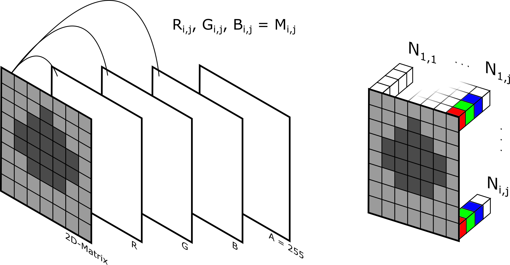
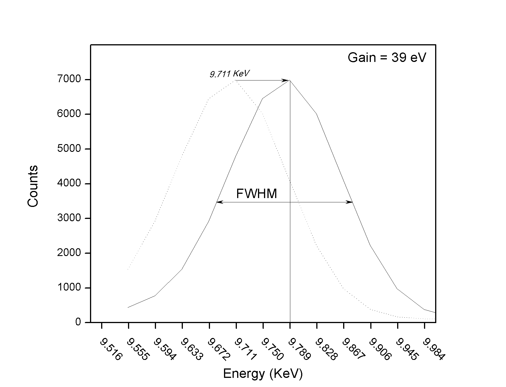

Updated April 29th, 2019

Here you can find information on how the code actually handles the data and how it calculates certain values.
To begin with, keep in mind that the files read by the algorithm are always spectra files. These files usually contain information such as the _live time_, _calibration data_ and obviously the _data_ itself. The files supported are \*.mca files or ASCII files containing two rows, one with channels and another with counts. 
_SpecRead.py_, as the name suggests, handles all the reading processes. It extracts the information contained in the spectra files and read essential configuration parameters required to run the algorithm. The configuration is set by the user at config.cfg file. It is simple and straight forward. 
_SpecMath.py_, _Mapping.py_ and _ImgMath.py_ contains a series of functions to manipulate and handle the data; from simple mathematical operations to the application of more advanced methods such as _SpecFitter.py_ and (until now) basic imaging processing.

## Mapping
This is the "core" of the algorithm. It contains the routines that will calculate and generate the elemental map(s) from the spectra files. So far it can create a single-element map, multi-element map (up to three elements), density map, ratio map and thickness map (the latter two are similar but the data is read in a different manner, e.g. the thickness map is a 3D plot of the surface and a re-interpretation of the ratio map). How each one is calculated and generated will be explained in the following paragraphs. Further information regarding the `-usage` is given in _REAMDME.md_ file.

#### Density map
This routine creates a 2D-matrix, where each element represents the total of _counts_ contained in that pixel. For a better understanding let's continue with an example: Suppose our data is composed of 600 spectra files representing a scanned area of 24x25 pixels. Assuming the _acquisition time_ of each spectrum is the same, the counts will therefore be direclty proportional to the density of the material measured at that spot.

In order to generate a true image, the matrix must be transformed into a RGBA format. The first step is to normalize our 2D-matrix of total counts, dividing each element (pixel) for the maximum value contained in the matrix and then multiplying each element by 255. The next steps are carried at `colorizing_fnc()` function, which will create a RGBA-style matrix turning each pixel (initially containing only one value) into a vector containing now 4 values (Figure 1 below) **attention: `colorizing_fnc()` function has some known bugs and corrections must yet be done. The color scales are limited to red, green or blue for the time being.**
Nonetheless, since we are creating a density map, a grayscale image is enough for visual interpretation. `colorizing_fnc()` funcion will apply a "gray" coloring mask to the 2D-matrix generated by _Mapping.py_ module by associating each element from the 2D-matrix to every color channel, R, G and B. A is maintained at the 255. The elemental maps instead, will be a particular case, where only one color layer is filled.

  

#### Elemental maps
Differently from the previous map, the elemental maps must compute the counts contained in very specific intervals of energy (or channels). Due to the statistical process involved in the acquisition of the data itself, count-to-charge ratio, X-ray soure emission curve and self-attenuation effect (among others), the peaks observed for each XRF line are represented by a gaussian distribution instead of a discrete line.
The typical XRF line energies, jump ration, fluorescence yields, cross-sections and more for each chemical element are calculated and available in open-source libraries as well as in printed XRF handbooks.

The data contained in each spectrum represents the counts per channel. Since the calculated energies for the XRF lines are given in KeV, a calibration curve must be calculated to "convert" the channels to energies.
This calibration curve is calculated following the linear regression method. The parameters are extracted from _config.cfg_ file, which also contains the dimension of the map to be created in lines x rows.

The function that creates the elemental map takes one chemical element at a time, e.g. `getpeakmap('X',ratio,plot,normalize,svg,peakmethod)`.
It is up to the algorithm to determine the region of interest (ROI) that represents each of the chemical elements the user wants to be found inside the spectrum data. This is made by reading the energy library _EnergyLib.py_ and accessing the theoretical values of lines Kα and Kβ (or Lα and Lβ if the element has an atomic number higher than 50)¹ for element X. If a second element Y is given as input, the process will repeat after the map acquisition of element X is complete, but now for element Y. 
To save some computing time, Kβ net peak is only searched for and calculated if a Kα peak was detected in the spectrum being read.

_¹If the excitation voltage used during the acquisition of the spectra was of let's say 30 Kv, there is no way one could observe the K-lines of mercury, for example in the obtained spectra._

##### Peak resolving
With the peak position for line Kα (lookup energy) of element J defined, the algorithm must calculate the ROI prior computing the peak net area. Adding to the situation, there is the fact that the calibration isn't always perfect (even with a correlation coefficient of 1) and there will always be some slight changes between the observed peak position and the theoretical value. In this case, the observed peak of Au-Lα line for example, could be found somewhere between 9.611 and 9.811 KeV. This interval is a subject of a greater discussion and involves the resolution of the detector, count-to-charge ratio and statistical treatment of data. For the time being, an interval of 1.10 times that of the peak Full Width at Half Maximum (FWHM) centered at the theoretical peak position is defined. This value has proven so far to be reasonable and does the job well.

  

The FWHM is equivalent to 2.3548 * σ, where σ is given by the following equation proposed by Solè et al., 2007 work and discussed in Van Grieken's Handbook of X-Ray spectrometry (Chapter 4):

Ej is the peak energy/characteristic line, NOISE is the electronic contribution to the peak width, FANO is the fano factor and 3.85 is the energy required to produce an electron-hole pair in silicon.

Nonetheless, the algorithm must still verify if the observed peak position matches the theoretical value (obtained from _EnegyLib.py_) in the ROI discussed above. This is done by verifying the maximum y value within the ROI. If y-max corresponds to the theoretical peak position, then the net peak area corresponding to 2 * FWHM is calculated, if not, and if the x value associated to y-max differs up to (1.10 * FWHM)/2 from the theoretical one, the code shifts the Kα line position for element J to the new x value and repeats the process one more time. This is called _shift_, which is also a variable that contains the y-max value, x-max value and y-max index inside the ROI array.
If after the second (or third) shift no correspondence is found between the lookup energy and the theoretical value, Kα peak of element J is said to be _False_. Let that be _True_, the algorithm will repeat the process but now for Kβ peak of the same element J. If Kβ results in a _False_ peak, then both peaks are said to be _False_. 
There are more criteria implemented to resolve the peaks, such as signal-to-noise ratio (SNR) evaluation and second differential calculation.

**Attention: The data array extrated from the spectrum by _SpecRead.py_ `getdata(spec)` function can be smoothed by _SpecMath.py_ if SNIPBG method was chosen as background estimation method. The smoothening increases the accuracy of peak identification method. It is carried inside `setROI(lookup,xarray,yarray,svg):` function and can be easily deactivated by just commenting a line of code. Nonetheless, second differential will always be calculated for the non-smoothened (RAW) data. The smoothing method is a simple Savitsky-Golay filter with a 11 points window and a 3rd order polynomial approximation. The second differential will also be smoothed regardless of the background stripping method and a cut-off filter at -1 will be applied to it.**

###### PyMcaFit
It is important to mention that the net peak areas can be calculated in many ways. So far the options `Simple` and `PyMcaFit` are available in _config.cfg_ file. `Simple` means that the area is calculated by summing over the defined ROI. Counts per channel. Corrections for background noise are configured separetely and are independent of the net peak calculation method except from the relation given in the above pragraph. `PyMcaFit` is more complex and therefore requires more processing time. This method fits every spectrum in the batch, spectrum by spectrum according to the input configuration. The fit configuration by now only requires a string of elements as input. FANO, NOISE, energy calibration, incident energy and incident angle are set to default values. The input elements in the configuration step must include all elements that may be present within the sample (excluding elements lighter than Z = 12). This method is slower and can yield slightly larger errors when compared to `Simple` method, but it will perform better if overlapping of peaks if present. For an unknown sample `PyMcaFit` is preferred.

##### Pixel value
Kα and Kβ net areas being sucessfully calculated, their sum is then attributed to the pixel in the same way as done for the density map. After iterating over the whole batch of spectra, the 2D-matrix is now calculated and must be normalized. This is done in respect to the maximum peak area found within the batch of spectra, in a way each element will be displayed proportionally to the element of greater abundance.

The normalization process follows:
* Read every spectrum and store the channel with the highest number of counts (y-max);
* Convert the channel number to energy;
* Access EnergyLib.py and look for a corresponding element for the y-max energy;
* If an element is found, store Kα and Kβ (or Lα and Lβ, accordingly);
* Calculate y_max peaks area and sum them;
* Divide each pixel by the max area.

The method for peak calculation inside the normalization process is the same used for the acquisition of the 2D-matrix that is being normalized. Following the same configurations applied prior the execution of the algorithm.

Last, the normalized 2D-matrix containing the net areas of element J K-Lines (or L-Lines) must be transformed into a RGBA image. The process follows the same recipe as the one used for the density map with the only difference that this time the element must receive a color so it can be distinguished from a second element in case it has been chosen to be generated as well.

In this process, each element from the 2D-matrix will replace a corresponding element (i,j) in only one color mask, e.g. B(i,j) = M(i,j) while R and G will remain equal to 0 and A equal to 255. This will transform the element M(i,j) = [counts] into Image(i,j) = [0,0,counts,255]

### Heightmap
